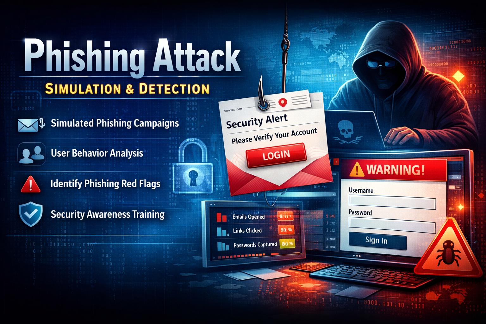

<!-- ======================= -->
<!--        BANNER          -->
<!-- ======================= -->
<p align="center">
  
</p>

<!-- ======================= -->
<!--         TITLE          -->
<!-- ======================= -->
<h1 align="center">Phishing Attack Simulation & Detection Lab</h1>

<!-- ======================= -->
<!--        SUBTITLE        -->
<!-- ======================= -->
<p align="center">
  SOC | Email Analysis | Threat Hunting | Security Awareness
</p>

<!-- ======================= -->
<!--        BADGES          -->
<!-- ======================= -->
<p align="center">
  
  
  
</p>

---

## 📌 Project Overview

Phishing is one of the most common and effective social engineering attacks used to compromise organizations.  
This project demonstrates a **controlled phishing attack simulation** conducted in a **lab environment** to analyze phishing techniques, observe user behavior, identify red flags, and document prevention strategies.

> ⚠️ **Ethical Notice**  
> This project was performed strictly for **educational and defensive security purposes**.  
> No real users, credentials, or organizations were targeted.

---

## 🎯 Objectives

- Understand how phishing attacks are designed and executed
- Simulate a phishing campaign in a controlled lab environment
- Analyze user interaction and response behavior
- Identify common phishing indicators and red flags
- Learn phishing prevention and mitigation techniques
- Improve social engineering awareness

---

## 🧰 Tools & Technologies

### Primary Tool
- **GoPhish** – Open-source phishing simulation framework

### Supporting Tools
- Kali Linux
- MailHog (SMTP testing)
- Visual Studio Code
- Web Browser
- Localhost / Virtual Machine environment

---

## 🛠️ Installing GoPhish on Kali Linux

### ✅ Step 1: Update Kali Linux

``bash
`sudo apt update && sudo apt upgrade -y`
### 🧠 Step 2: Check System Architecture
`uname -m` <br>
Expected Output:

- ✅ x86_64 → Supported

- ❌ aarch64 (ARM) → Use an x86_64 VM

### 📁 Step 3: Move to /opt Directory
`cd /opt`
### 📥 Step 4: Download GoPhish
`sudo wget https://github.com/gophish/gophish/releases/download/v0.12.1/gophish-v0.12.1-linux-64bit.zip`
### 📦 Step 5: Extract GoPhish
`sudo unzip gophish-v0.12.1-linux-64bit.zip` <br>
`cd gophish`
### 🔑 Step 6: Make GoPhish Executable
`sudo chmod +x gophish`
### ⚙️ Step 7: Configure GoPhish
`sudo nano config.json`
Change:

- "listen_url": "0.0.0.0:3333"
To:

- "listen_url": "127.0.0.1:3333"
- 
## ▶️ Launch GoPhish
`sudo ./gophish`
Access the dashboard at:

`http://127.0.0.1:3333`


---

--- 

✉️ STEP 1: Create a Phishing Email Template
- Email Template Settings:

- Name:
* Password Reset Simulation – Test 2

- Envelope Sender:
`IT Support <it-support@lab.local>`

- Subject:
  * Password Reset Required

- Email Content (Text)
```
Hello {{.FirstName}},

We received a request to reset your account password.

If this was you, please confirm using the link below:
{{.URL}}

If you did not request this, please review immediately.

This email is part of a security awareness exercise.
Email Content (HTML)
<html>
  <body style="font-family: Arial;">
    <h3>Password Reset Notice</h3>
    <p>Hello {{.FirstName}},</p>
    <p>A password reset request was initiated for your account.</p>
    <p>
      <a href="{{.URL}}" style="background:#2980b9;color:white;padding:10px 16px;text-decoration:none;border-radius:4px;">
        Confirm Reset
      </a>
    </p>
    <p style="font-size:12px;color:gray;">
      This is a cybersecurity awareness simulation.
    </p>
  </body>
</html>
```
---
---
## ✅ Leave Add Tracking Image enabled
👉 Save Template


## 🌐 STEP 2: Create a Landing Page
- Name:
  * Password Reset Awareness – Test 2

```
<html>
  <body style="font-family: Arial; text-align:center; margin-top:80px;">
    <h2>Password Reset Simulation</h2>
    <p>This was a simulated phishing email.</p>
    <p>Real attackers often use fake password reset messages to steal credentials.</p>
    <p style="color:green;">Always verify reset requests before clicking links.</p>
  </body>
</html>
``` 
- ❌ Do NOT enable “Capture Submitted Data”
- 👉 Save Page


## 📧 STEP 3: Configure Sending Profile (MailHog)
- Name: MailHog Lab

- Interface: SMTP

- SMTP From: alerts@bank-lab.local

- Host: 127.0.0.1:1025

- Username/Password: (leave empty)

- ✅ Ignore Certificate Errors
  ---
  

## 🚀 STEP 4: Launch Campaign
- Campaign Name: Password Reset Test – Feb 2026

- Email Template: Password Reset Simulation – Test 2

- Landing Page: Password Reset Awareness – Test 2

- URL: http://127.0.0.1

- Sending Profile: MailHog Lab

- Group: Security Awareness Lab – Feb 2026


## 📊 STEP 5: Monitor Results
 - MailHog Dashboard:

`http://127.0.0.1:8025`


## 📊 Tracking & Response Analysis
- Metric	Description
- Emails Sent	Total phishing emails
- Emails Opened	User curiosity
- Links Clicked	Phishing susceptibility
- Forms Submitted	High-risk behavior
  
## 🛡️ Prevention & Mitigation
- User Awareness
- Verify sender identity

- Hover over links before clicking

- Never share credentials via email

- Technical Controls
  * [SPF, DKIM, DMARC]

 - Email filtering

- Multi-factor authentication (MFA)
 ---
## 👤 Author
Name: NATTO MUNI CHAKMA  <br>
Role: Cybersecurity Student | SOC Analyst (Aspirant)  |  Blue Team Learner
--- 

---

📚 References
GoPhish Official Documentation
https://docs.getgophish.com

MITRE ATT&CK – Phishing (T1566)
https://attack.mitre.org/techniques/T1566/

OWASP Top 10 – Social Engineering
https://owasp.org

NIST SP 800-61 – Incident Handling Guide
https://csrc.nist.gov/publications/detail/sp/800-61/rev-2/final

---

🔒 Disclaimer
This project is for educational and defensive cybersecurity purposes only.
Any misuse of these techniques outside an authorized lab environment is strictly prohibited.
